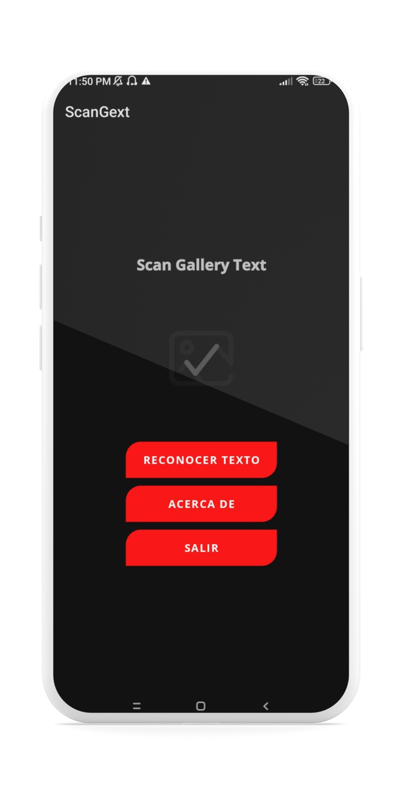
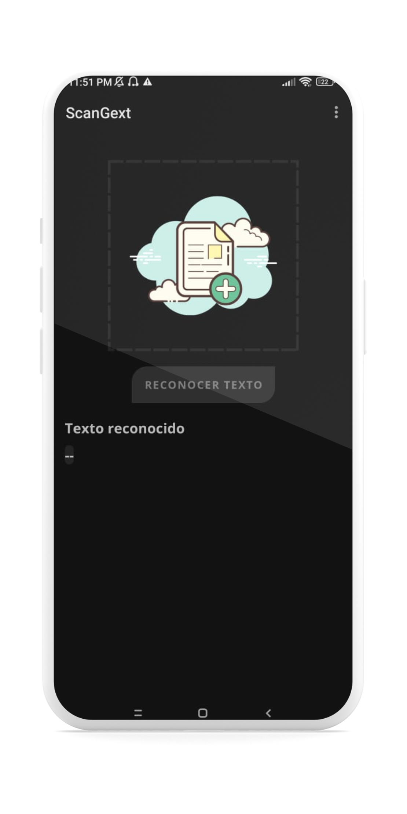
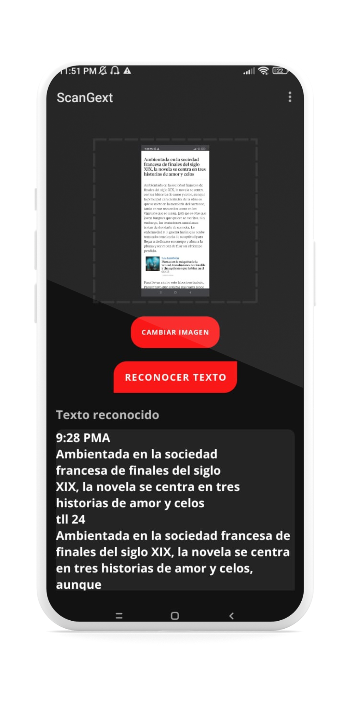
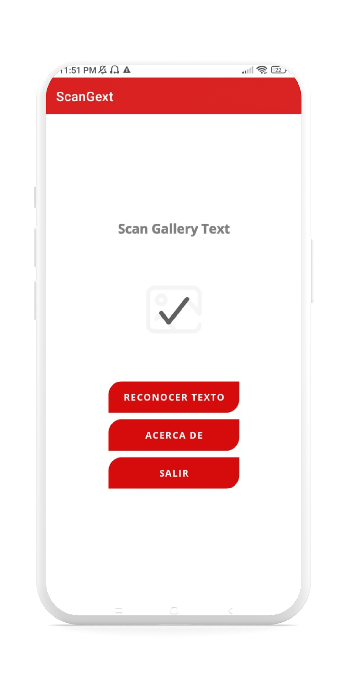
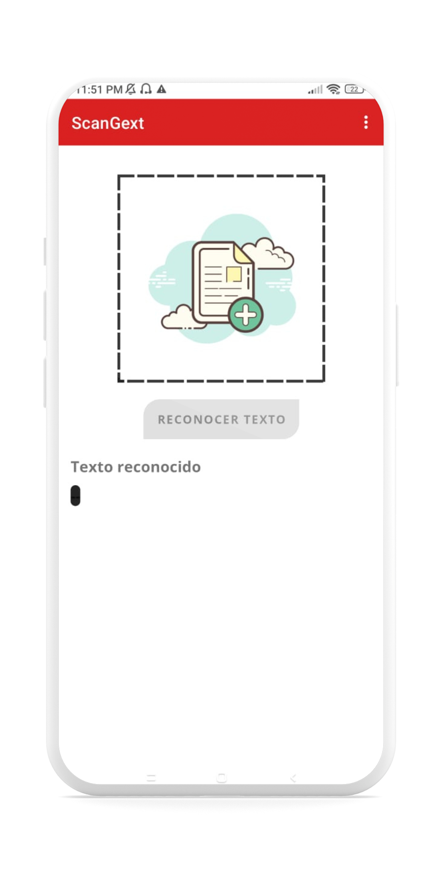
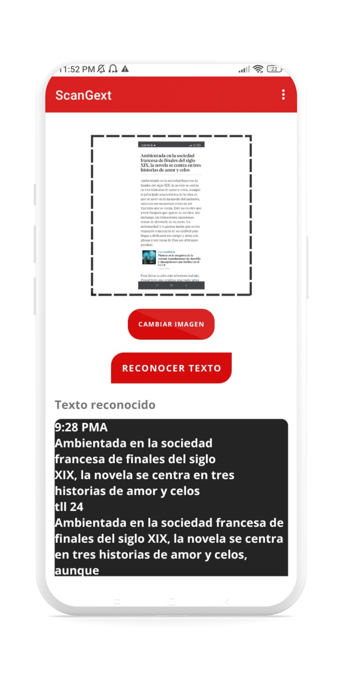

<br />
<div align="center">
  <a href="#">
    
  </a>

<h1 align = "center">
<b><i>ScanGext</i></b>
</h1>

  <p align="center">
    Scan Image Text
    <br />


  
[Screenshots](#camera_flash-screenshots-camera_flash) ~

[License](#scroll-License-scroll:)  
 
</div>
    
ScanGext (Scan Image Text) is an application that allows you to select images from your gallery to get the text of that image immediately. If you want to use it in real time, it is allowed, you have the option to focus your camera on the document and have it immediately

# :camera_flash: **Screenshots** :camera_flash:

ScanGext, the app that makes it easy to extract text from images, now has beautiful animations thanks to Lottie. Whether you use photos from your gallery or capture images in real time, ScanGext offers you a visually pleasing and functional experience. With the integration of [**GOOGLE ML KIT DEVELOPER**](https://developers.google.com/ml-kit?hl=es-419), converting images to text has never been so simple and streamlined.

<p align="center">
 &nbsp;&nbsp;&nbsp;&nbsp;
 &nbsp;&nbsp;&nbsp;&nbsp;   
 &nbsp;&nbsp;&nbsp;&nbsp;
 &nbsp;&nbsp;&nbsp;&nbsp; 
</p>

<p align="center">
 &nbsp;&nbsp;&nbsp;&nbsp;
 &nbsp;&nbsp;&nbsp;&nbsp;   
 &nbsp;&nbsp;&nbsp;&nbsp;
 &nbsp;&nbsp;&nbsp;&nbsp; 
</p>


# :gear: Tech Stack :gear:

ScanGext project uses popular libraries and tools in the Android Ecosystem

* [Lottie](com.airbnb.android:lottie:4.2.1) - To render animations
* [ML Google Kit](https://developers.google.com/ml-kit?hl=es-419) - To Machine Learning AI Options


#  :scroll: **License**  :scroll:


```
MIT License

Copyright (c) [2023] [Harry Bodán]

Permission is hereby granted, free of charge, to any person obtaining a copy
of this software and associated documentation files (the "Software"), to deal
in the Software without restriction, including without limitation the rights
to use, copy, modify, merge, publish, distribute, sublicense, and/or sell
copies of the Software, and to permit persons to whom the Software is
furnished to do so, subject to the following conditions:

The above copyright notice and this permission notice shall be included in all
copies or substantial portions of the Software.

THE SOFTWARE IS PROVIDED "AS IS", WITHOUT WARRANTY OF ANY KIND, EXPRESS OR
IMPLIED, INCLUDING BUT NOT LIMITED TO THE WARRANTIES OF MERCHANTABILITY,
FITNESS FOR A PARTICULAR PURPOSE AND NONINFRINGEMENT. IN NO EVENT SHALL THE
AUTHORS OR COPYRIGHT HOLDERS BE LIABLE FOR ANY CLAIM, DAMAGES OR OTHER
LIABILITY, WHETHER IN AN ACTION OF CONTRACT, TORT OR OTHERWISE, ARISING FROM,
OUT OF OR IN CONNECTION WITH THE SOFTWARE OR THE USE OR OTHER DEALINGS IN THE
SOFTWARE.
```
